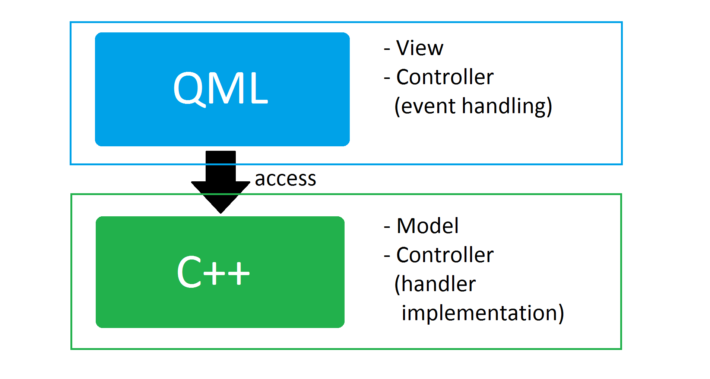
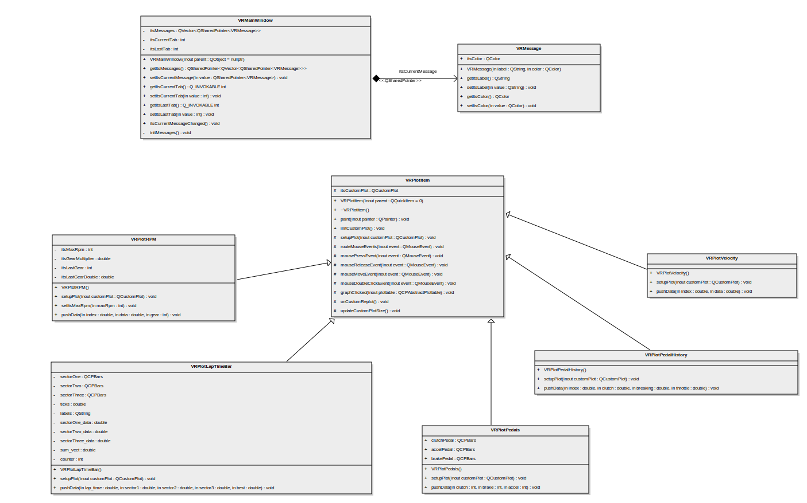
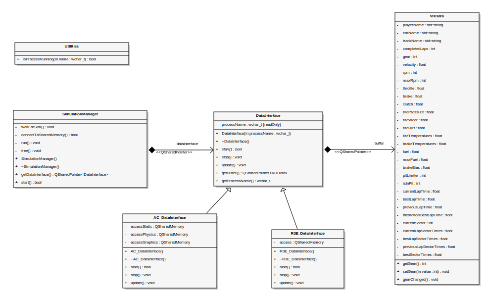

# Software Architecture Document

# Table of Contents
- [Introduction](#1-introduction)
    - [Purpose](#11-purpose)
    - [Scope](#12-scope)
    - [Definitions, Acronyms and Abbreviations](#13-definitions-acronyms-and-abbreviations)
    - [References](#14-references)
    - [Overview](#15-overview)
- [Architectural Representation](#2-architectural-representation)
- [Architectural Goals and Constraints](#3-architectural-goals-and-constraints)
- [Use-Case View](#4-use-case-view)
- [Logical View](#5-logical-view)
    - [Overview](#51-overview)
    - [Architecturally Significant Design Packages](#52-architecturally-significant-design-packages)
- [Process View](#6-process-view)
- [Deployment View](#7-deployment-view)
- [Implementation View](#8-implementation-view)
- [Data View](#9-data-view)

## 1. Introduction
### 1.1 Purpose
This document provieds an overview of the system architecture. It contains a quick overview of the realization of the MVC-pattern as well as class diagrams which are relevant for the implementaion.  

### 1.2 Scope
This document describes the architecture of the VisualRacing-Analytics-Tool.

### 1.3 Definitions, Acronyms and Abbreviations
n/a
### 1.4 References
n/a
### 1.5 Overview
n/a
## 2. Architectural Representation
In our project we are using the Qt-Framework. In fact Qt is misusing the MVC-terminology a little bit. All views are implemented in QML, which is a javascript based ui-modeling language. Some parts of the controller (for example event handling) is realized in the QML-part. The model is represented by the C++ backend and provides all the data to QML. As the C++ part is also the backend, it implements also the event-handlers from QML.

## 3. Architectural Goals and Constraints
With using Qt Quick we have the possibility to develop a C++ application in an MVC-like way. The QML-Layer should only be responsible for the view, ui-components and the user-event-catching. All the event-handler-implementation should be realized in the C++ Layer to provide consitensy and a faster implementation (C++ is faster than javascript). All QML-Objects should get bound to C++ properties. As a result the model is a C++ Object. As in other MVC-implementations we have only dependencies from QML (the view) to C++ (our backend).  

## 4. Use-Case View
n/a
## 5. Logical View
All QML objects are internally implemented as C++ Classes. The following graphic gives an overview of our custom QML-Object implementations. Because our analytics tool provides many graphical visualiziations we use our own plot implementation, for this we developed our optimized base class VRPlotItem. General window properties get managed by the MainWindow class. In the future there will join some other QML-Object implementations.

As our application is based on data which is provided by an external racing simulation, we additionally need a data interface that reads the data outputted by the simulation and provides this data as a model to our view and controller. This data interface has no connection to the visualization-code of our application, so we created a separate class diagram for our data interface.

As we are currently working on the data mapping, there will be some further changes to the class VRData. We will update the diagram accordingly.

### 5.2 Architecturally Significant Design Packages
n/a
## 6. Process View
n/a
## 7. Deployment View
n/a
## 8. Implementation View
n/a
## 9. Data View
n/a