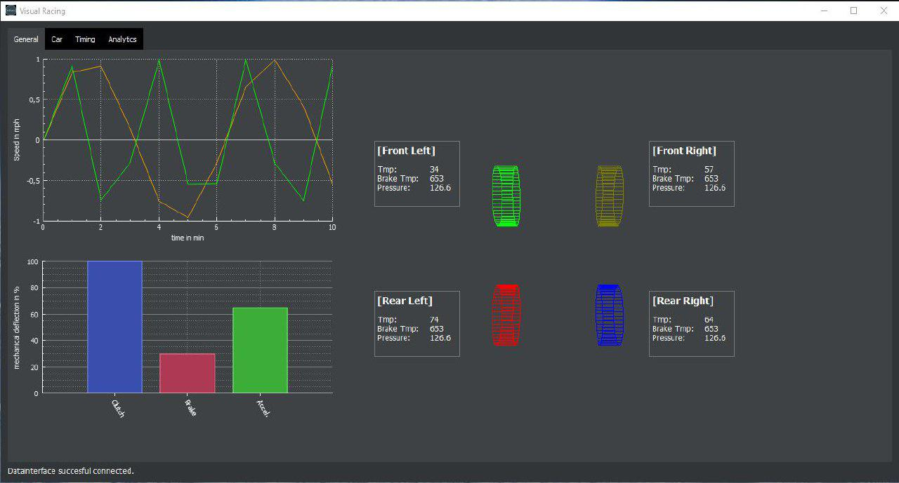

# VisualRacing - Software Requirements Specification

# Table of Contents
- [Introduction](#1-introduction)
    - [Purpose](#11-purpose)
    - [Scope](#12-scope)
    - [Definitions, Acronyms and Abbreviations](#13-definitions-acronyms-and-abbreviations)
    - [References](#14-references)
    - [Overview](#15-overview)
- [Overall Description](#2-overall-description)
    - [Vision](#21-vision)
    - [Product perspective](#22-product-perspective)
    - [User characteristics](#23-user-characteristics)
    - [Dependencies](#24-dependencies)
- [Specific Requirements](#3-specific-requirements)
    - [Functionality - Data Backend](#31-functionality--data-backend)
    - [Functionality - User Interface](#32-functionality--user-interface)
    - [Functionality - Data Analytics](#33-functionality--data-analytics)
    - [Usability](#34-usability)
    - [Reliability](#35-reliability)
    - [Performance](#36-performance)
    - [Supportability](#37-supportability)
    - [Design Constraints](#38-design-constraints)
    - [Online User Documentation and Help System Requirements](#39-online-user-documentation-and-help-system-requirements)
    - [Purchased Components](#310-purchased-components)
    - [Interfaces](#311-interfaces)
    - [Licensing Requirements](#312-licensing-requirements)
    - [Legal, Copyright and other Notices](#313-legal-copyright-and-other-notices)
    - [Applicable Standards](#314-applicable-standards)
- [Supporting Information](#4-supporting-information)

# 1. Introduction
## 1.1 Purpose
The purpose of this document is to provide a general overview and a detailed description of the VisualRacing project. In order of achieving this, it explains the general vision or rather the purpose and all the features of the product. This document offers insights into the system, its interfaces and the constraints of the product.

## 1.2 Scope
This document is designed for internal use only and will outline the development process of the project. An overview of the features and modules of the product are documented in the use case diagram (Overall Description).

## 1.3 Definitions, Acronyms and Abbreviations
|Term||
|-|-|
|**SRS**|Software Requirements Specification|
|**RPM**|revolutions per minute (e.g. of an engine)|
|**sim racing**|collective term for computer software that attempts to accurately simulate auto racing (see [Wikipedia](https://en.wikipedia.org/wiki/Sim_racing) for more information)|

## 1.4 References

|Title|Date|
|-|-|
|[Blog](https://visualracing.wordpress.com/)|10/05/2017|
|[GitHub](https://github.com/VisualRacing/VisualRacing)|10/23/2017|
|[Software Architecture Document](https://github.com/VisualRacing/VisualRacing/blob/master/organization/SAD/SAD.MD)|12/10/2017|
|[Use Case Diagram](UC/Use%20Case%20Diagram.png)|10/23/2017|
|[UC Change Settings](UC/UC_ChangeSettings/UC_ChangeSettings.MD)|10/25/2017|
|[UC Read Data Stream](UC/UC_ReadDataStream/UC_ReadDataStream.MD)|10/25/2017|
|[UC Car Data](UC/UC_CarData/UC_CarData.MD)|11/13/2017|
|[UC Timing Data](UC/UC_TimingData/UC_TimingData.MD)|11/27/2017|
|[UC General Data](UC/UC_GeneralData/UC_GeneralData.MD)|11/28/2017|

## 1.5 Overview
The following chapters contain our vision and perspective in the Overall Description based on the use case diagram as well as more detailed software requirements.

# 2. Overall Description
## 2.1 Vision
The goal of VisualRacing is to create a tool which enhances the sim racing experience and allows people to improve their capabilities behind the steering wheel. It will be able to visualize information from a connected racing simulation.

Probably, there will be simple key figures, different kinds of graphs and more advanced visualization methods. Furthermore the tool will make it possible to analyze the driving behavior and help improve one&#39;s skills.

Lap times and information about velocity are some examples of what is supposed to be displayed. In addition to that VisualRacing has access to much more detailed data, like the selected gear, the engines RPM, engine and tire temperatures, tire wear and much more. Furthermore information from the drivers input, like the position of the pedals, can be displayed. This allows the driver to see where on the track he could start accelerating a bit earlier or where he can improve the work with the clutch to improve the shift-times.

## 2.2 Product perspective

*use case diagram*

## 2.3 User characteristics
Our target group consists of racing simulation enthusiasts as most of the visualized data requires certain foreknowledge to fully understand and to benifit from it.

## 2.4 Dependencies
VisualRacing depends on a working racing simulation that enables it to read all necessary data from the shared memory block.

# 3. Specific Requirements
## 3.1 Functionality – Data Backend
### 3.1.1 Read data stream
The backend accesses the shared memory block, in which the racing simulation writes all of the relevant data, and reads this data stream. ([Use-Case Specification](UC/UC_ReadDataStream/UC_ReadDataStream.MD))

### 3.1.2 Adapt data structure
The data, which is read, has to be transformed into a general data structure, so that the program can work with multiple racing simulations, which potentially have different data structures.

### 3.1.3 Provide data
To display the data, it has to be provided to the UI via an interface.

### 3.1.4 Record data
Instead of just reading and providing the data to the frontend, this functionality records the data stream.

### 3.1.5 Save recorded data
The recorded data has to be saved in an efficient way.

## 3.2 Functionality – User Interface
### 3.2.1 General overview
The general overview is somewhat of a home screen, which provides basic information at a glance and lets the user dive deeper into different datasets in form of tabs. ([Use-Case Specification](UC/UC_GeneralData/UC_GeneralData.MD))

### 3.2.2 Car data
Displays the car data such as tire temperatures, tire wear, fuel consumption etc. ([Use-Case Specification](UC/UC_CarData/UC_CarData.MD))

### 3.2.3 Timing data
This functionality gives a detailed insight into the different sector times, best and current lap time and so on. ([Use-Case Specification](UC/UC_TimingData/UC_TimingData.MD))

### 3.2.4 Race data
The information which is helpful for the driver changes with the session he is in. The race data overview shows the drivers position in the race, as well as a list of all drivers, their positions and lap times etc.

### 3.2.5 Driver input data
Displays driver input data such as the positions of the pedals or the steering wheel.

### 3.2.6 Change Settings
Shows the current settings such as whether the metric or the imperial system should be used and allows the user to change these. The settings will be saved in a file. ([Use-Case Specification](UC/UC_ChangeSettings/UC_ChangeSettings.MD))

### 3.2.7 Analytics
Here the analyzed data will be visualized or textualized and be given as a feedback for the driver.

## 3.3 Functionality – Data Analytics
### 3.3.1 Analyze lap time improvements
Analyzes the sector times and gives hints for improving.

### 3.3.2 Analyze driving behavior
Tries to give helpful tips to improve the driving behavior based on the pedal position, shift-times etc.

### 3.3.3 Analyze tire management
Takes a look at the sector times, lap times, tire temperature and tire wear and analyzes this information.

### 3.3.4 Analyze fuel consumption
Analyzes the engines RPM, the gear, fuel consumption to give helpful feedback.

## 3.4 Usability
### 3.4.1 Racing geeks
In general to &#39;use&#39; VisualRacing one needs no training at all, as it mainly visualizes data for racing simulations.

However, in order to get VisualRacing running you need to play one of the supported racing simulations and to understand all of the visualized data one has to know quite a lot about racing simulations and competitive driving.

## 3.5 Reliability
### 3.5.1 Availability
VisualRacing needs access to the shared memory block, in which a racing simulation is writing its data. Otherwise no data will be available.
Availability solely depends on the users configuration and whether the racing simulation is supported.

### 3.5.2 Accuracy
The displayed data depends on the data provided in the shared memory block to be as accurate as possible.
Because this is the only source for data, VisualRacing is only as accurate as the data provided by the racing simulation.

## 3.6 Performance
### 3.6.1 Response time
To provide the data for visualization without any noticable delay, we have to make sure to keep internal response times to a minimum. Based on previous experiences a delay of more than 50 ms has a negative impact on the user experience.  

### 3.6.2 Throughput
Our goal is to update the displayed information on the user interface at least every 10 ms.

### 3.6.3 Capacity
This only applies to recording driving data for analytics. As we have no experience with the amount of data we are dealing with yet, we are not able to do any estimations on how much data we have to store and how compact the data structure can be.

### 3.6.4 Resource utilization
As VisualRacing will run next to a racing simulation which will consume many resources, we have to make it, especially the rendering process, as lightweight as possible.

## 3.7 Supportability
### 3.7.1 Similar data structure
If the different racing simulations use a similar data structure and identical datasets, the program will support all visualizations and the maintainability is easier as the data does not need to be adapted to a general data structure.

## 3.8 Design Constraints
### 3.8.1 Qt-Framework
The Qt-Framework supports C++ or JavaScript for the software logic and we decided to use C++ as it fits our needs better.

### 3.8.2 OS-Support
Although the Application will be written in C++, which is capable of running across multiple platforms, VisualRacing will be limited to Windows users as nearly all of the racing simulations only run on Windows.

### 3.8.3 Supported Games
To start with VisualRacing will support [AssettoCorsa](http://www.assettocorsa.net/en/) and [RaceRoom Racing Experience](http://game.raceroom.com/).

## 3.9 Online User Documentation and Help System Requirements
n/a

## 3.10 Purchased Components
### 3.10.1 Racing simulation required
A racing simulation is required for VisualRacing to display data. Furthermore most racing geeks have a steering wheel to play their racing simulation because it does not really work that well using mouse and keyboard.

## 3.11 Interfaces
### 3.11.1 User Interfaces
The main user interface is structured in tabs. Each use case described in the section [Functionality - User Interface](#ui) will be visualized in a separate tab.

### 3.11.2 Hardware Interfaces
VisualRacing needs to have access to the shared memory block, in which the racing simulation writes all of the data.

### 3.11.3 Software Interfaces
n/a

### 3.11.4 Communications Interfaces
n/a

## 3.12 Licensing Requirements
Under [MIT License](https://github.com/VisualRacing/VisualRacing/blob/master/LICENSE).

## 3.13 Legal, Copyright and other Notices
n/a

## 3.14 Applicable Standards
n/a

# 4. Supporting Information

*screenshot of first UI-mockup*