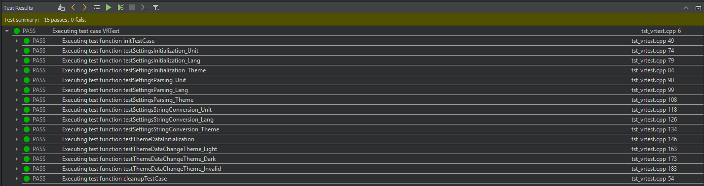
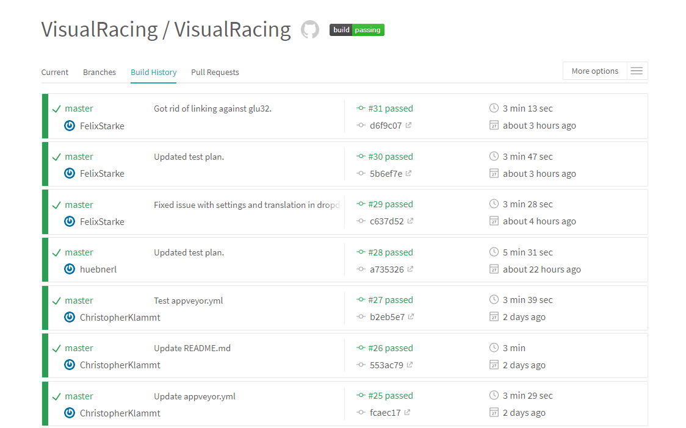
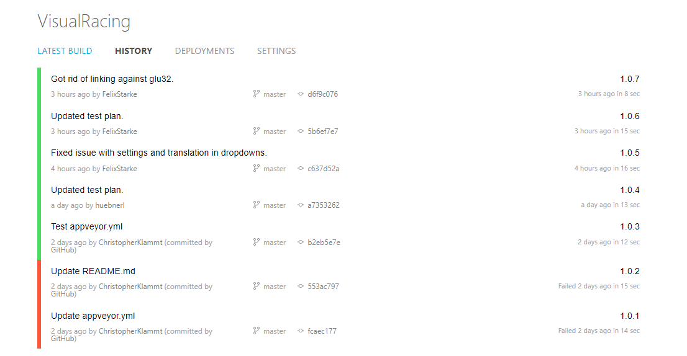
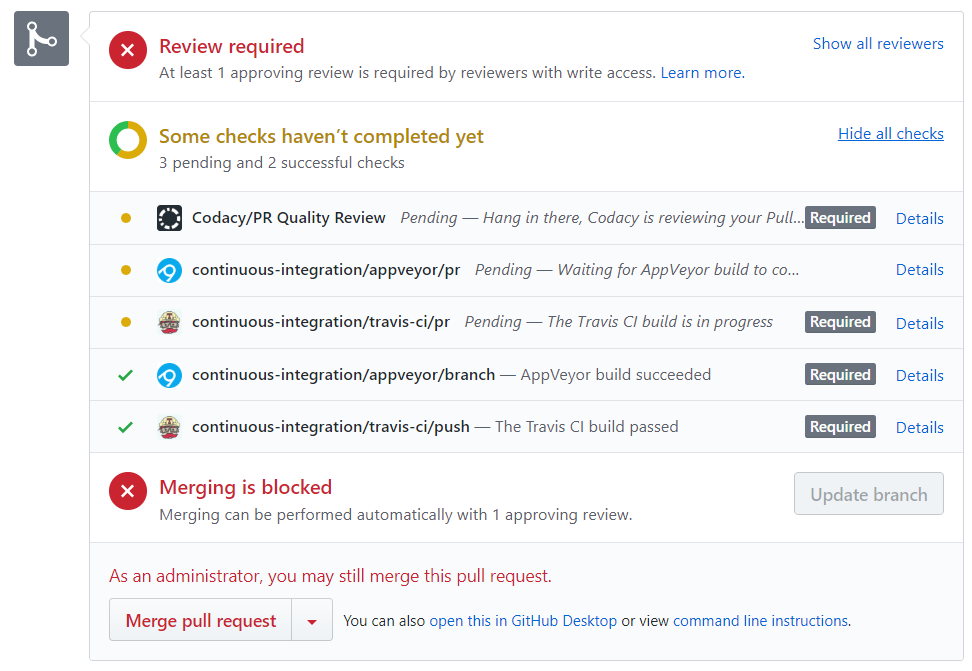
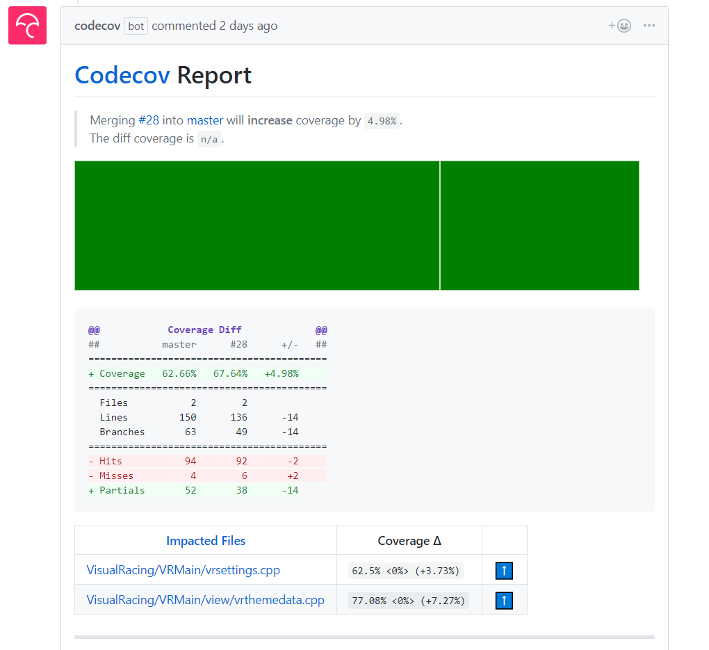

# VisualRacing - Test Plan

# Table of Contents
- [Introduction](#1-introduction)
    - [Purpose](#11-purpose)
    - [Scope](#12-scope)
    - [Intended Audience](#13-intended-audience)
    - [Document Terminology and Acronyms](#14-document-terminology-and-acronyms)
    - [References](#15-references)
- [Evaluation Mission and Test Motivation](#2-evaluation-mission-and-test-motivation)
    - [Background](#21-background)
    - [Evaluation Mission](#22-evaluation-mission)
    - [Test Motivators](#23-test-motivators)
- [Target Test Items](#3-target-test-items)
- [Outline of Planned Tests](#4-outline-of-planned-tests)
    - [Outline of Test Inclusions](#41-outline-of-test-inclusions)
    - [Outline of Other Candidates for Potential Inclusion](#42-outline-of-other-candidates-for-potential-inclusion)
    - [Outline of Test Exclusions](#43-outline-of-test-exclusions)
- [Test Approach](#5-test-approach)
    - [Testing Techniques and Types](#51-testing-techniques-and-types)
- [Entry and Exit Criteria](#6-entry-and-exit-criteria)
    - [Test Plan](#61-test-plan)
- [Deliverables](#7-deliverables)
    - [Test Evaluation Summaries](#71-test-evaluation-summaries)
    - [Reporting on Test Coverage](#72-reporting-on-test-coverage)
    - [Perceived Quality Reports](#73-perceived-quality-reports)
    - [Incident Logs and Change Requests](#74-incident-logs-and-change-requests)
    - [Smoke Test Suite and Supporting Test Scripts](#75-smoke-test-suite-and-supporting-test-scripts)
- [Testing Workflow](#8-testing-workflow)
- [Environmental Needs](#9-environmental-needs)
    - [Base System Hardware](#91-base-system-hardware)
    - [Base Software Elements in the Test Environment](#92-base-software-elements-in-the-test-environment)
    - [Productivity and Support Tools](#93-productivity-and-support-tools)
- [Responsibilites, Staffing and Training Needs](#10-responsibilities-staffing-and-training-needs)
    - [People and Roles](#101-people-and-roles)
    - [Staffing and Training Needs](#102-staffing-and-training-needs)
- [Iteration Milestones](#11-iteration-milestones)
- [Risks, Dependencies, Assumptions and Constraints](#12-risks-dependencies-assumptions-and-constraints)

## 1. Introduction
### 1.1 Purpose
The purpose of the Iteration Test Plan is to gather all of the information necessary to plan and control the test effort for a given iteration. 
It describes the approach to testing the software.
This Test Plan for VisualRacing supports the following objectives:

- Identifying the items that should be targeted by the tests.
- Identifying the motivation for and ideas behind the test areas to be covered.
- Outlining the testing approach that will be used.
- Identifying the required resources and providing an estimation for the test efforts.

### 1.2 Scope
The Visual Racing application is tested using unit tests as a testing method to ensure that the implementation is working correctly throughout the development.

The QML user interface components will not be tested except the logical implementation components.
In this document the unit tests are described.

### 1.3 Intended Audience
This test plan contains more technically detailed information and does not provide a description of the application itself. Therefore this document is for advanced readers with the necessary background knowledge and should be used primarily by active developers of the project.

### 1.4 Document Terminology and Acronyms

| Abbr | Abbreviation                        |
|------|-------------------------------------|
| CI   | Continuous Integration              |
| n/a  | not applicable                      |
| SRS  | Software Requirements Specification |
| tbd  | to be determined                    |
| TDD  | Test Driven Development             |
| UI   | User Interface                      |

### 1.5 References

|Title|Date|
|-|-|
|[Blog](https://visualracing.wordpress.com/)|10/05/2017|
|[GitHub](https://github.com/VisualRacing/VisualRacing)|10/23/2017|
|[Software Architecture Document](https://github.com/VisualRacing/VisualRacing/blob/master/organization/SAD/SAD.MD)|12/10/2017|
|[Use Case Diagram](UC/Use%20Case%20Diagram.png)|10/23/2017|
|[UC Change Settings](UC/UC_ChangeSettings/UC_ChangeSettings.MD)|10/25/2017|
|[UC Read Data Stream](UC/UC_ReadDataStream/UC_ReadDataStream.MD)|10/25/2017|
|[UC Car Data](UC/UC_CarData/UC_CarData.MD)|11/13/2017|
|[UC Timing Data](UC/UC_TimingData/UC_TimingData.MD)|11/27/2017|
|[UC General Data](UC/UC_GeneralData/UC_GeneralData.MD)|11/28/2017|
|[UC Record and Save/Load Data](UC/UC_RecordSaveLoad/UC_RecordSaveLoad.MD)|04/09/2018|
|[UC Analyze Laptime Improvement](UC/UC_AnalyzeLaptimeImprovement/UC_AnalyzeLaptimeImprovement.MD)|04/09/2018|
|[UC Analyze Driving Behavior](UC/UC_AnalyzeDrivingBehavior/UC_AnalyzeDrivingBehavior.MD)|04/09/2018|
|[UC Display Analytics](UC/UC_SeeAnalytics/UC_SeeAnalytics.MD)|04/16/2018|

## 2. Evaluation Mission and Test Motivation
### 2.1 Background
Test coverage for our project gives us the possibility to be sure that future changes will not lead to functional problems. With the integration of testing into the deployment process we can ensure that just stable versions of our project which meet the desired quality requirements are being deployed. This leads to a better control of new implementations and the deployment process.

### 2.2 Evaluation Mission
Test are necessary for providing stable and working versions of our project and to ensure that bugs or other problems can be identified as early as possible. The functionality of our methods and implementations can be verified automatically with the concept of continuous testing. With Test Driven Development (TDD) the tests are getting written before the functionality itself gets implemented. TDD helps a lot to prevent problems and bugs before they occur.

### 2.3 Test Motivators
Quality as well as stability and functional risks motivated us to use testing for this project. To ensure our application and its functions fulfill the requirements, it is very important to test these. Additionally it helps implementing the Use Cases with a correct working result.

## 3. Target Test Items
In the following list the tested parts of our application are listed. Tests will cover the main backend functionality as well as the logical implementations in the QML UI part.

Tested parts:

- C++ backend functionality 
- QML logical / algorithmic components

## 4. Outline of Planned Tests
### 4.1 Outline of Test Inclusions
Backend functionality will be tested with unit tests.

QML functionality will be tested with unit tests.

The tests themselves are not going to be tested and will not be part of the calculation of code coverage.

### 4.2 Outline of Other Candidates for Potential Inclusion
User interface testing would be an additional option to provide a working application. Furthermore performance testing of the application might be an interesting part of quality management to ensure a stable application that fulfills the performance requirements.

### 4.3 Outline of Test Exclusions
n/a

## 5. Test Approach

### 5.1 Testing Techniques and Types

#### 5.1.1 Unit Testing
The concept of unit testing is to structure the code into pieces that are as small as possible. These units ar going to be tested individually to check the functionality on the lowest possible level. Due to this partitioning of the implementation, bugs and problems can be found rather easily. If the granular functionalities have been approved, the units can be put together to modules, which then will be tested on this higher level. Unit Testing has proven to be a good way to find bugs and problems in software early and reliable.

For unit testing QTest and Qt Quick Test are used in this project.

|                        | Description                         | 
|------------------------|-------------------------------------|
| Technique Objective    | Ensure that the implemented functions are working as expected. |
| Technique              | Implement QTests and Qt Quick tests |
| Oracles                | Test Logs, console printings and code coverage calculations |
| Required Tools         | QtCreator |
| Success Criteria       | All tests pass and the required code coverage is given |
||[TravisCI](https://travis-ci.org/VisualRacing/VisualRacing) and [Appveyor](https://ci.appveyor.com/project/ChristopherKlammt/visualracing) build pass and all tests run green|
| Special Considerations | - |

#### 5.1.2 Performance testing
Performance is not being tested at the moment.

## 6. Entry and Exit Criteria
### 6.1 Test Plan

#### 6.1.1 Test Plan Entry Criteria
The process of testing is to be executed when a new version of the application was committed to GitHub and built.

#### 6.1.2 Test Plan Exit Criteria
The process of testing leads to a passing of all tests without errors.

## 7. Deliverables

## 7.1 Test Evaluation Summaries
For testing multiple continuous integration services to build and executes the tests are used. This leads to an automatic testing on every commit.

| Continuous Integration Service      |  Badge |
|-------------------------------------|---------------|
|TravisCI||
|AppVeyor||

The first image shows how running the tests in the QtCreator looks like. The second and third image give an insight in how the build history of TravisCI and AppVeyor look like.

## 7.2 Reporting on Test Coverage
After AppVeyor has built the application successfully the code coverage will be calculated based on the tests and their results. 
This badge shows the current test coverage:

## 7.3 Perceived Quality Reports
For calculating quality reports Codacy is used. This tool calulates the amount of errors and much more metrics wich can be used to measure the code quality. 

The following badge shows the latest status of the reports:

## 7.4 Incident Logs and Change Requests

We integrated TravisCI, AppVeyor and Codacy into our GitHub pull request workflow. If a build fails (or a reviewer dismisses the Pull Request), the merging of the Pull Request is blocked.

## 7.5 Smoke Test Suite and Supporting Test Scripts
Each pull request triggers codecov to generate a report showing the new test coverage. The screenshot below shows how such a report looks like:

## 8. Testing Workflow
For testing parts of new code each developer can use the option of running the test from the IDE. This helps a lot to check if new code works as expected. 

Additionally the test process is executed with every commit.

## 9. Environmental Needs

### 9.1 Base System Hardware

For testing the build status no specific hardware is required.
For an extensive test including the connection to a Racing Sim, a computer including a Racing Sim is needed. Additionally racing gear would make the testing a lot easier.

### 9.2 Base Software Elements in the Test Environment

The following base software elements are required in the test environment for this Test Plan.

|Software Element Name|Type|
|-|-|
|QtTest|Unit Testing Library|
|QtCreator|Local Test Runner and IDE|

### 9.3 Productivity and Support Tools

The following tools will be employed to support the test process for this Test Plan.

|Tool Category or Type|Tool Brand Name|
|-|-|
|Code Hoster|[github.com](github.com)|
|Test Coverage Monitor|[codecov.io](codecov.io)|
|CI Service|[travis-ci.org](travis-ci.org)|
|CI Service|[appveyor.com](appveyor.com)|
|Metrics Tool|[codacy.com](codacy.com)|

## 10. Responsibilities, Staffing and Training Needs

### 10.1 People and Roles

This table displays the staffing assumptions for the test effort of our project.

|Role|Minimum Resources Recommended|Specific Responsibilities|
|-|:-:|-|
|Test Manager|1|Ensures that testing is complete and conducted for the right motivators|
|Test Analyst|1 |Selects what to test based on the motivators|
|Test Designer|1|Decides what tests should be automated vs. manual and creates automations|
|Tester|2|Implements and executes the tests|

### 10.2 Staffing and Training Needs
n/a

## 11. Iteration Milestones
Our goal is to keep code coverage above 60% for the classes we are testing.

## 12. Risks, Dependencies, Assumptions and Constraints
Risks regarding the integration of new Unit Tests into our Test workflow will be handled by the Implementer directly.
