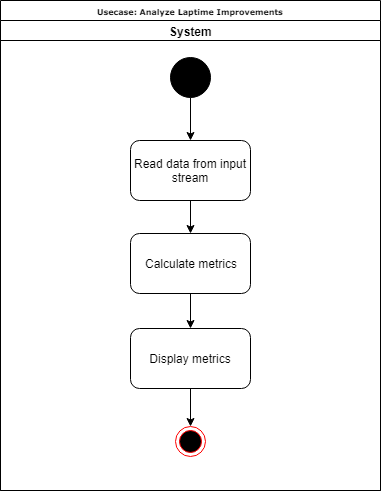

# Use-Case Specification: Analyze Laptime Improvement

# Table of Contents
- [Use-Case Name](#1-analyze-laptime-improvement)
    - [Brief Description](#11-brief-description)
- [Flow of Events](#2-flow-of-events)
    - [Basic Flow](#21-basic-flow)
    - [Alternative Flows](#22-alternative-flows)
- [Special Requirements](#3-special-requirements)
- [Preconditions](#4-preconditions)
- [Postconditions](#5-postconditions)

# 1. Analyze Laptime Improvement
## 1.1 Brief Description
The use case 'Analyze Laptime Improvement' calculates different metrics that show how and where the drivers laptime can be improved and how it has changed over time. Those calculations are based on information like sector times etc.

# 2. Flow of Events
## 2.1 Basic Flow

## 2.2 Alternative Flows
n/a

# 3. Special Requirements
n/a

# 4. Preconditions
To calculate the laptime-metrics an input data stream is necessary. This can either come from the live data or from a recorded session which has been loaded.

# 5. Postconditions
n/a

