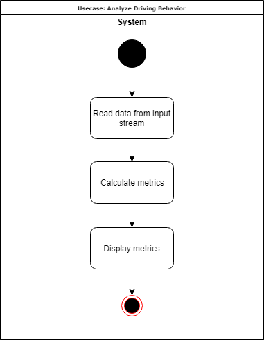

# Use-Case Specification: Analyze Upshift Times
# Table of Contents
- [Analyze Upshift Times](#1-analyze-upshift-times)
    - [Brief Description](#11-brief-description)
- [Flow of Events](#2-flow-of-events)
    - [Basic Flow](#21-basic-flow)
    - [Alternative Flows](#22-alternative-flows)
- [Special Requirements](#3-special-requirements)
- [Preconditions](#4-preconditions)
- [Postconditions](#5-postconditions)

# 1. Analyze Upshift Times
## 1.1 Brief Description
The use case 'Analyze Upshift Times' determines the time it takes the driver to change to a higher gear. This obviously makes more sense in car with a manual transmission. Two different times will be calculated. The first on is the time the clutch was disengaged, which is the total time needed for the gear shift, as this is the time the car is not putting any power to the wheels. The other time just indicates how long the driver needed to get the transmission out of gear and back into the new gear.

# 2. Flow of Events
## 2.1 Basic Flow

## 2.2 Alternative Flows
n/a

# 3. Special Requirements
n/a

# 4. Preconditions
To calculate the upshift times an input data stream is necessary.

# 5. Postconditions
n/a
