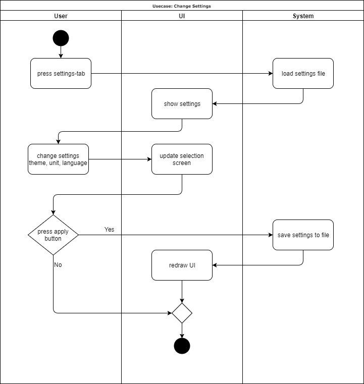

# Use-Case Specification: Change Settings

# Table of Contents
- [Use-Case Name](#1-use-case-name)
    - [Brief Description](#11-brief-description)
- [Flow of Events](#2-flow-of-events)
    - [Basic Flow](#21-basic-flow)
    - [Alternative Flows](#22-alternative-flows)
- [Special Requirements](#3-special-requirements)
- [Preconditions](#4-preconditions)
- [Postconditions](#5-postconditions)
- [Extension Points](#6-extension-points)

# 1. Change Settings
## 1.1 Brief Description

## 1.2 Mockup

# 2. Flow of Events
## 2.1 Basic Flow

## 2.2 Alternative Flows

# 3. Special Requirements

# 4. Preconditions

# 5. Postconditions

# 6. Extension Points

