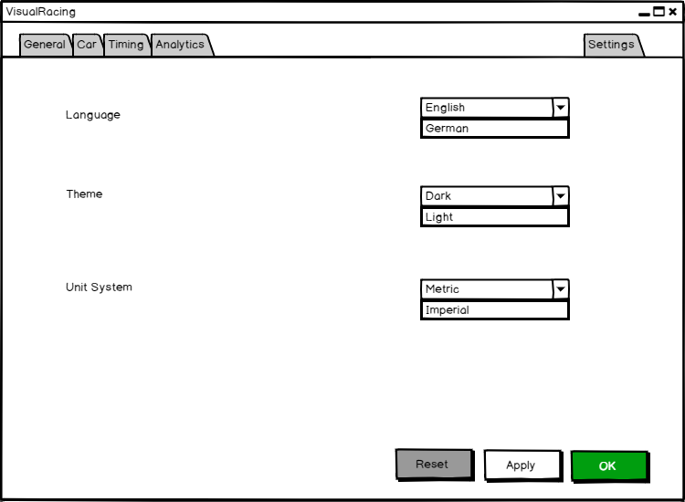
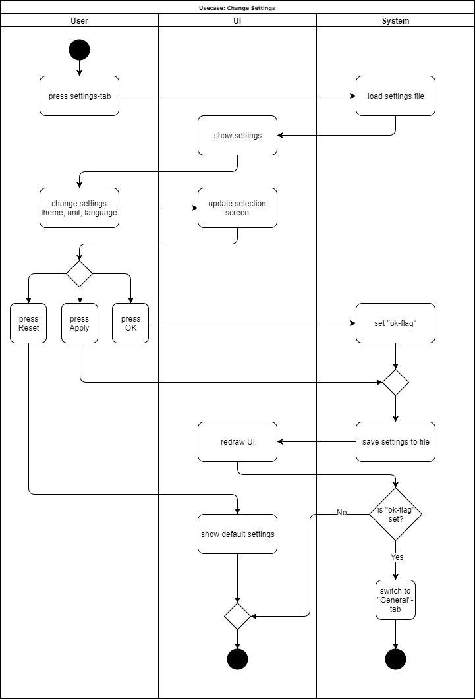

# Use-Case Specification: Change Settings

# Table of Contents
- [Use-Case Name](#1-use-case-name)
    - [Brief Description](#11-brief-description)
- [Flow of Events](#2-flow-of-events)
    - [Basic Flow](#21-basic-flow)
    - [Alternative Flows](#22-alternative-flows)
- [Special Requirements](#3-special-requirements)
- [Preconditions](#4-preconditions)
    - [Settings File](#41-settings-file)
- [Postconditions](#5-postconditions)
- [Extension Points](#6-extension-points)

# 1. Change Settings
## 1.1 Brief Description
The purpose of this use case is that the user to change the settings to his personal preference.
As for now there will be settings regarding the unit system (whether to use the imperial or metric system), the language and which theme the user wants to apply to the Application (Light or Dark theme).
In order to do so the system has to fetch the already saved settings and load them accordingly. Then the user can make his desired changes which will by saved and applied by pressing the button 'Apply'. Then the UI will be redrawn and updated.

## 1.2 Mockup

# 2. Flow of Events
## 2.1 Basic Flow

When a user switched to the settings-tab, the system will load the settings from a settings-file to provide them on the UI. Now the user has the possibility to change settings like "theme", "unit" and "language". After choosing personal preferences the user can decide if he want to apply his changes or reset the selection screen to the default values. To apply the changes we provide an Apply-Button and a OK-Button. While the Apply-Button just updates the UI and saves the changes the OK-Button additionaly will take the user back to the tab from which he came from.

## 2.2 Alternative Flows

# 3. Special Requirements

# 4. Preconditions
## 4.1 Settings file
For the program to display the saved settings, the settings file has to exist in the program directory. Otherwise a new file will be created with the default values.

# 5. Postconditions
As a result of this use case the settings have been changed according to the users preferences.

# 6. Extension Points

