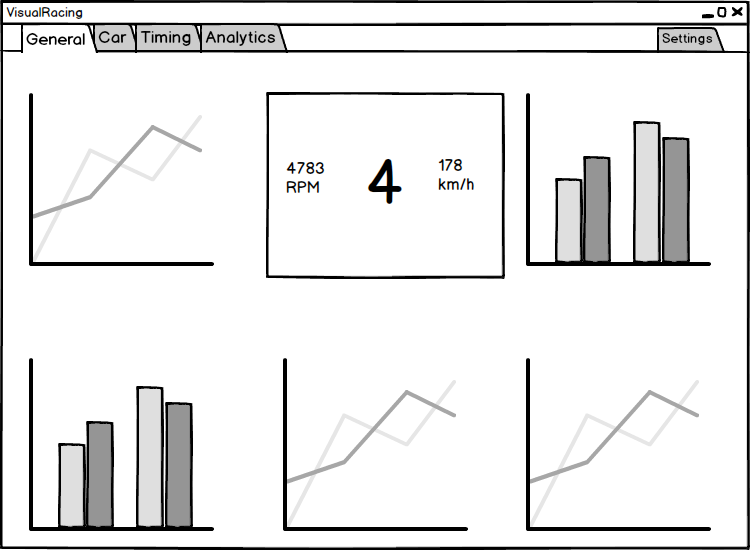
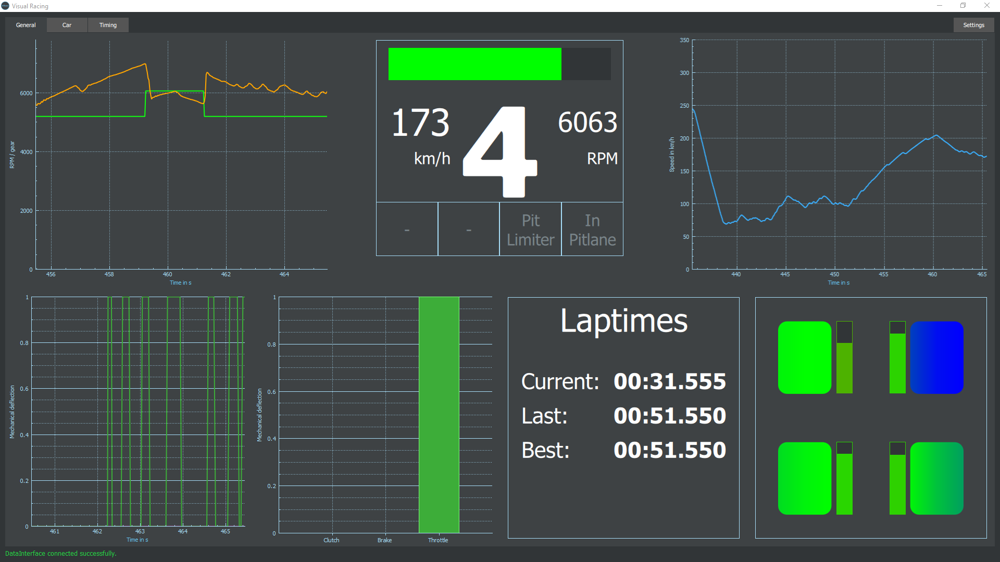
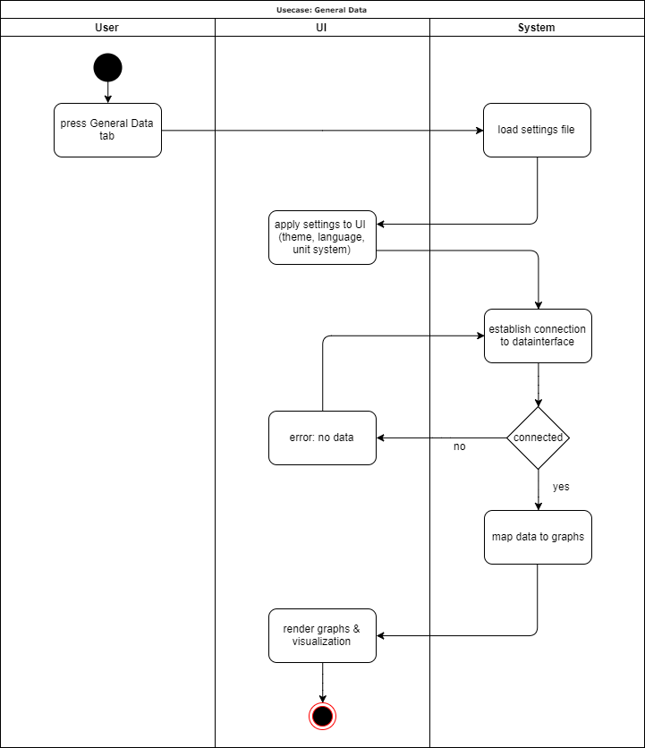
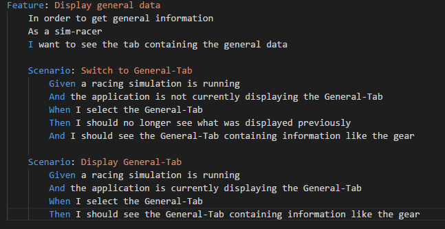
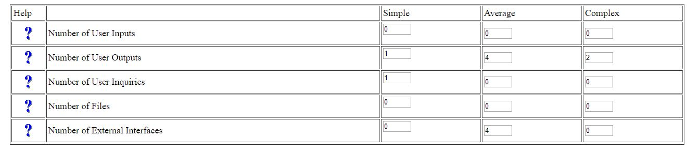

# Use-Case Specification: Display General Data

# Table of Contents
- [Display Car Data](#1-display-car-data)
    - [Brief Description](#11-brief-description)
    - [Mockup](#12-mockup)
    - [Screenshot](#13-screenshot)
- [Flow of Events](#2-flow-of-events)
    - [Basic Flow](#21-basic-flow)
    - [Alternative Flows](#22-alternative-flows)
- [Special Requirements](#3-special-requirements)
- [Preconditions](#4-preconditions)
    - [Settings File](#41-settings-file)
- [Postconditions](#5-postconditions)
- [Function Points](#6-function-points)

# 1. Display Car Data
## 1.1 Brief Description
The application is divided into a few tabs and the purpose of this use case is for the user to switch to the tab 'General Data'. 
For the tab to load all of the visualizations, graphs and tables the connection to the datainterface has to be established. Then the necassary data is mapped to the graphs. Additionally, the settings have to be loaded to apply how the application should look, which language and unit system to use.

## 1.2 Mockup

## 1.3 Screenshot

# 2. Flow of Events
## 2.1 Basic Flow

When the user clicks on the tab button 'General', the settings are loaded and applied (theme, language, unit system) and the necessary data is loaded through the datainterface. If establishing the connection to the datainterface fails, an error will be thrown and a message will be displayed, e.g. 'No Data'.
Provided the connection is succesfully established, the data is mapped to the according graphs and the UI including graphs, visualizations, tables etc. is rendered.

You can see the .feature file that describes this Use-Case [here](../../features/generalData.feature) or on the screenshot below:

## 2.2 Alternative Flows
n/a

# 3. Special Requirements
A supported racing simulation has to be running for a succesful connection to the datainterface. This connection is required to display data in the tab 'Car Data'.

# 4. Preconditions
## 4.1 Settings file
For the application to be displayed using the correct settings, the settings file has to exist in the program directory. Otherwise the default settings will be used.

# 5. Postconditions
As a result of this use case the user can see the General Data tab and all of the graphs, visualizations and tables are rendered correctly.

# 6. Function Points
For calculating the Function Points we used the tool on [this](http://groups.umd.umich.edu/cis/course.des/cis375/projects/fp99/main.html) website.

For the following Input we got a score of: **71.8 Function Points**.
This Use Case needed *10:33h* to be implemented.

