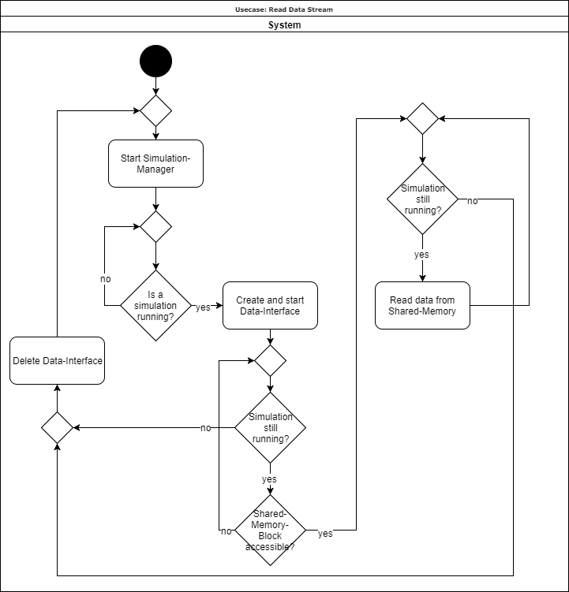

# Use-Case Specification: Read Data Stream

# Table of Contents
- [Use-Case Name](#1-use-case-name)
    - [Brief Description](#11-brief-description)
- [Flow of Events](#2-flow-of-events)
    - [Basic Flow](#21-basic-flow)
    - [Alternative Flows](#22-alternative-flows)
- [Special Requirements](#3-special-requirements)
- [Preconditions](#4-preconditions)
- [Postconditions](#5-postconditions)
- [Extension Points](#6-extension-points)

# 1. Read Data Stream
## 1.1 Brief Description
The use case 'Read Data Stream' is responsible for establishing a connection with the shared memory block in which the game's data is written and continuously reading from it. To achieve this, it has to recognize whether a game has been started and which game it is. Then it reads the specified data from the shared memory block.

# 2. Flow of Events
## 2.1 Basic Flow

## 2.2 Alternative Flows
n/a

# 3. Special Requirements
n/a

# 4. Preconditions
This usecase is one of the first to be executed after the application started, therefore there are no preconditions.

# 5. Postconditions
This usecase is running in system scope during the entire runtime of the application, therefore there are no postconditions

# 6. Extension Points
n/a
