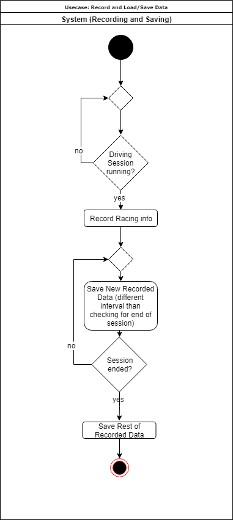
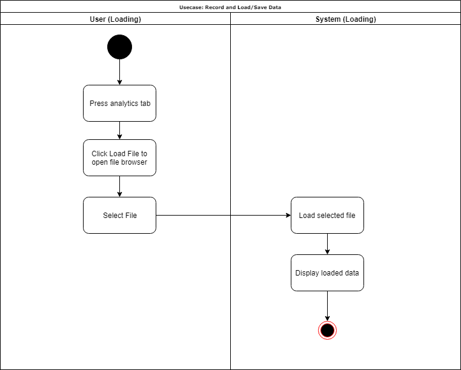

# Use-Case Specification: Record and Save/Load Data

# Table of Contents
- [Use-Case Name](#1-record-and-save-and-load-data)
    - [Brief Description](#11-brief-description)
- [Flow of Events](#2-flow-of-events)
    - [Basic Flow](#21-basic-flow)
    - [Alternative Flows](#22-alternative-flows)
- [Special Requirements](#3-special-requirements)
- [Preconditions](#4-preconditions)
- [Postconditions](#5-postconditions)
- [Extension Points](#6-extension-points)

# 1. Record and Save and Load Data
## 1.1 Brief Description
To get the most out of the analytics capabilites of the VisualRacing tool, the user is able to record and save the live data to load it at a later point in time to run the analytic algorithms.

# 2. Flow of Events
## 2.1 Basic Flow

When the application detects the start of a new game session the recording will start. All relevant information will be saved to the local storage. The saving should happen in regular intervals to prevent huge data loss in case the game or the application crashes. The saved file format can be read and loaded from the Analytics-Tab.

## 2.2 Alternative Flows
### 2.2.1 Loading driving data

This alternative flow shows the process of selecting and loading a previously saved set of driving data.

# 3. Special Requirements
A supported racing simulation has to be running for a succesful connection to the datainterface.

# 4. Preconditions
n/a

# 5. Postconditions
As a result of this use case a file containing all relevant information should have been created on the users local storage.

# 6. Extension Points
n/a
