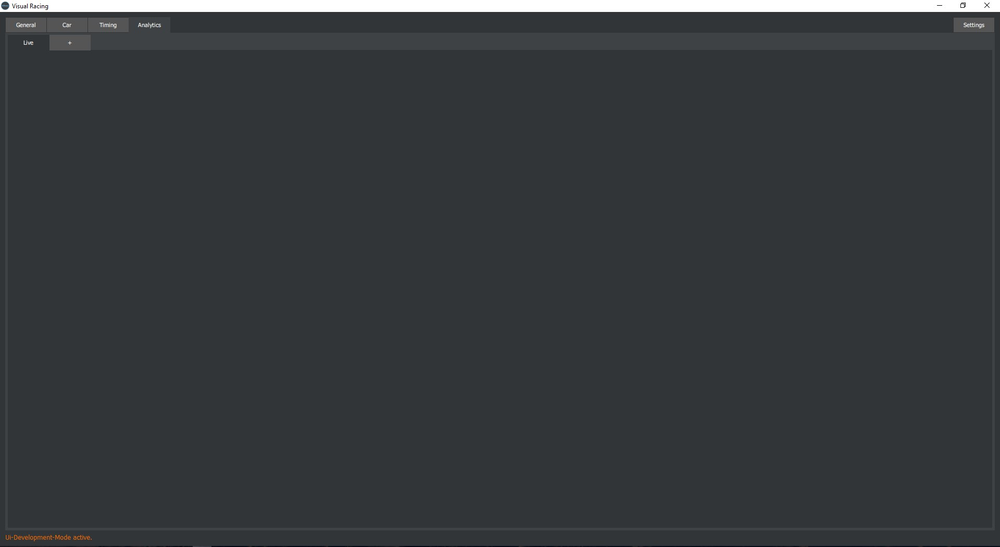
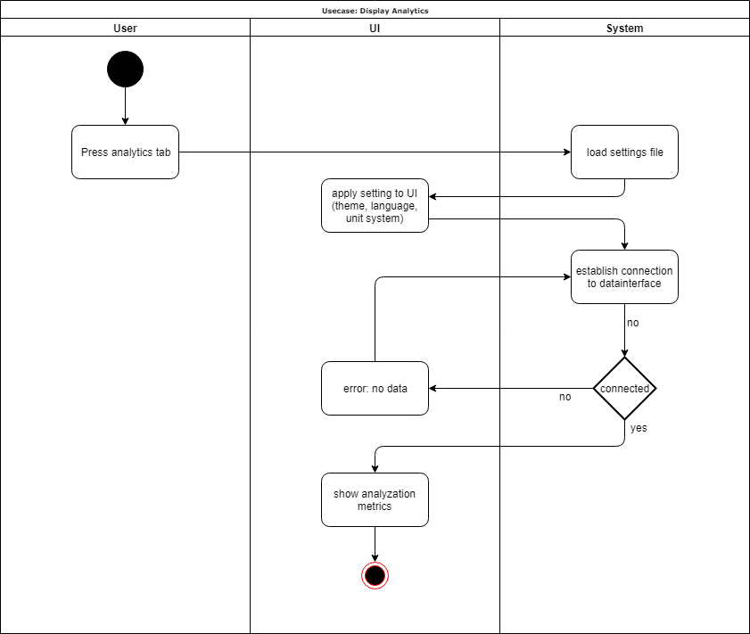
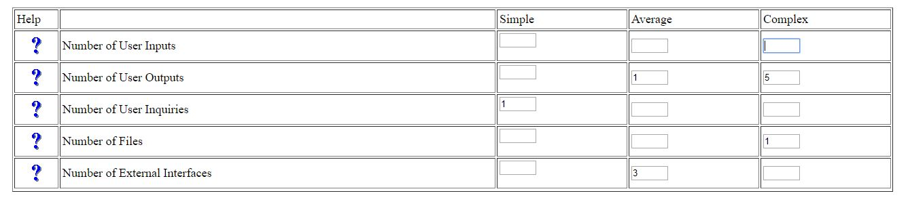

# Use-Case Specification: Display Analytics

# Table of Contents
- [Display Car Data](#1-display-car-data)
    - [Brief Description](#11-brief-description)
    - [Mockup](#12-mockup)
    - [Screenshot](#13-screenshot)
- [Flow of Events](#2-flow-of-events)
    - [Basic Flow](#21-basic-flow)
    - [Alternative Flows](#22-alternative-flows)
- [Special Requirements](#3-special-requirements)
- [Preconditions](#4-preconditions)
    - [Settings File](#41-settings-file)
- [Postconditions](#5-postconditions)
- [Function Points](#6-function-points)

# 1. Display Analytics
## 1.1 Brief Description
The application is divided into a few tabs and the purpose of this use case is for the user to switch to the tab 'Analytics'. 

## 1.2 Mockup
n/a

## 1.3 Screenshot
Organization of the Analyticstab:

# 2. Flow of Events
## 2.1 Basic Flow

When the user clicks on the tab button 'Analytics', the settings are loaded and applied (theme, language, unit system) and the necessary data is loaded through the datainterface. If establishing the connection to the datainterface fails, an error will be thrown and a message will be displayed, e.g. 'No Data'.
Provided the connection is succesfully established, the calculated analysation metrics are mapped to the according graphs and the UI including graphs, visualizations, tables etc. is rendered.

## 2.2 Alternative Flows
n/a

# 3. Special Requirements
A supported racing simulation has to be running for a succesful connection to the datainterface.

# 4. Preconditions
## 4.1 Settings file
For the application to be displayed using the correct settings, the settings file has to exist in the program directory. Otherwise the default settings will be used.

# 5. Postconditions
As a result of this use case the user can see the Analytics tab and all of the graphs, visualizations and tables are rendered correctly.

# 6. Function Points
For calculating the Function Points we used the tool on [this](http://groups.umd.umich.edu/cis/course.des/cis375/projects/fp99/main.html) website.

For the following Input we got a score of: **82.2 Function Points**.
This results in an estimation of *13:13h* for this Use Case.

